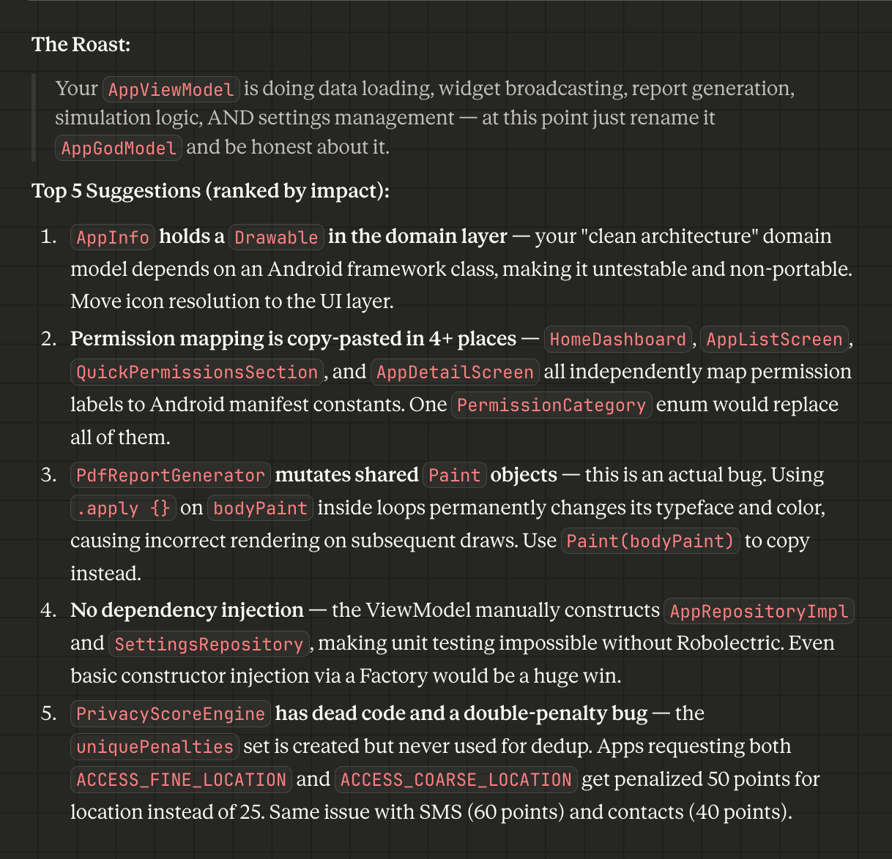

# 🤖 Android Code Roaster

Give your Android code the tough love it deserves. This tool delivers a sharp, witty one-line roast followed by the top 5 most impactful suggestions to turn your "GodModel" into clean, modern architecture.

## ✨ Features

- **Witty Roasts**: A senior-dev-style reality check for your codebase.
- **Top 5 Impactful Tips**: Ranked by how much they'll actually help your app.
- **Full Stack Support**: Covers Kotlin, Jetpack Compose, Java, and XML layouts.
- **Modern Standards**: Focused on recomposition fixes, state management, dependency injection, and performance.

---

## 🚀 How to Use

This project is designed as a **Skill/System Prompt** for AI agents and LLMs. Here’s how to set it up in your favorite tools:

### 🎭 Claude (via Projects)
1. Open a **Claude Project**.
2. Go to the **Project Knowledge** section.
3. Upload the `SKILL.md` file or copy its content into the "Custom Instructions" for the project.
4. **Trigger**: Simply share your code and ask, "What do you think of this code?" or "Roast my code."

### ⌨️ Cursor (via .cursorrules)
1. Create or open a `.cursorrules` file in your root directory.
2. Copy the content of `SKILL.md` into it.
3. **Trigger**: Use the Composer (`Cmd+I`) or Chat (`Cmd+L`) and say "Review this file" or "Give it to me straight."

### 🧑‍💻 Other Tools (ChatGPT, Gemini, etc.)
1. Copy the contents of `SKILL.md`.
2. Paste it as a **System Message** or the first prompt in a new chat session.
3. Share your Android snippets (Kotlin, Java, or XML).

---

## 🏗️ How it Works

The Roaster follows a 4-step process:
1. **Analyze**: Scans the full picture (architecture, patterns, naming).
2. **Roast**: Crafts a single, brutally honest but playful sentence.
3. **Prioritize**: Selects the 5 changes that will make the biggest difference.
4. **Report**: Delivers a structured markdown report with **Before/After** snippets.

---

## 📄 License

    Copyright 2026 MyInnos

    Licensed under the Apache License, Version 2.0 (the "License");
    you may not use this file except in compliance with the License.
    You may obtain a copy of the License at

       http://www.apache.org/licenses/LICENSE-2.0

    Unless required by applicable law or agreed to in writing, software
    distributed under the License is distributed on an "AS IS" BASIS,
    WITHOUT WARRANTIES OR CONDITIONS OF ANY KIND, either express or implied.
    See the License for the specific language governing permissions and
    limitations under the License.
---

*Roasted with love for better Android code.*
